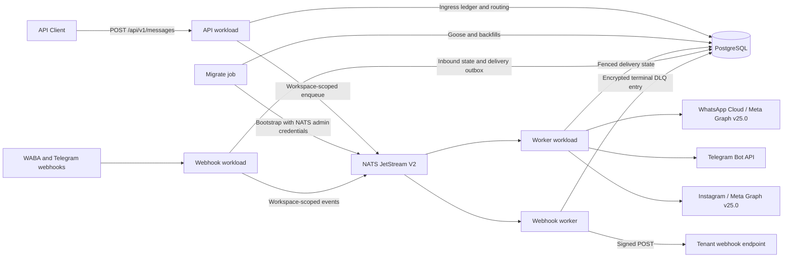

<!-- generated-by: gsd-doc-writer -->
# PerGo Architecture Overview

PerGo is a self-hosted messaging gateway with a unified public ingestion API,
durable PostgreSQL state, and workspace-isolated NATS JetStream queues.

## Supported Deployment Boundary

The deployed build runs the same image as four separate workloads:

* `pergo migrate` applies Goose migrations, performs required data backfills,
  maintains audit partitions, and bootstraps the owned JetStream resources.
* `pergo api` accepts authenticated public and admin API traffic.
* `pergo webhook` verifies and ingests provider webhooks.
* `pergo worker` consumes outbound, campaign, inbound, and webhook work.

The `all` profile and automatic startup migrations are for development/test
only. Deployed `api`, `webhook`, and `worker` replicas do not modify the schema
or bootstrap NATS.

The supported deployed dispatchers are WhatsApp Cloud (`whatsapp_cloud`),
Telegram (`telegram`), and Instagram (`instagram`). The unofficial WhatsApp Web
adapter, QR pairing, session restoration, local SMTP, Chatwoot, and Typebot
routing are development-only in this build.

Production media is deliberately disabled. `PERGO_MEDIA_MODE=disabled` is
required outside development/test, `memory` is only a local fake, and
`PERGO_S3_*` settings do not enable a production storage implementation. The
current production pilot is therefore text-only.

Self-hosting provides deployment and data-custody controls, but does not by
itself establish GDPR, LGPD, or other regulatory compliance. Operators remain
responsible for configuration, retention, provider terms, and legal controls.

## Component Diagram

Long-running workloads use role-specific NATS credentials. Only the one-shot
migration/bootstrap job receives NATS administration privileges.

## JetStream Contract

Callers use a small set of logical subjects. The publisher extracts
`workspace_id` from the payload and maps every owned message to a concrete
workspace subject. The physical streams are:

| Stream | Subject pattern | Duplicate window |
| --- | --- | --- |
| `PERGO_V2_OUTBOUND` | `pergo.v2.outbound.<workspace_id>` | 24 hours |
| `PERGO_V2_WEBHOOK_EVENTS` | `pergo.v2.webhook_events.<workspace_id>` | 7 days |
| `PERGO_V2_WEBHOOK_DELIVERIES` | `pergo.v2.webhook_deliveries.<workspace_id>` | 24 hours |
| `PERGO_V2_INBOUND` | `pergo.v2.inbound.<workspace_id>` | 7 days |
| `PERGO_V2_CAMPAIGNS` | `pergo.v2.campaigns.<workspace_id>` | 24 hours |

The stream wildcard subjects end in `.>`, but normal publication resolves to
the exact workspace subject shown above. Outbound and campaign capacity is
limited to 1,000 messages per subject; event queues use their own per-workspace
limits. Backpressure is therefore durable and tenant-scoped rather than a
process-local or global counter.

For mapped subjects, the publisher sets `Nats-Msg-Id` to
`<workspace_id>:<logical_trace_id>`. Equal trace IDs in different workspaces do
not deduplicate each other. Internal logical publisher inputs are implementation
details; operators bootstrap and monitor only the `PERGO_V2_*` physical stream
contract.

## Data Flow

### Outbound Ingestion

1. [MessageHandler.Create](../../internal/api/handler/message.go) authenticates
   the workspace and requires both `Idempotency-Key` and `X-Trace-ID`.
2. A short PostgreSQL transaction claims a workspace-scoped ingress-ledger row,
   binds the exact request hash to the trace, and allocates the stable public
   `message_id`. Replays return the persisted receipt; conflicting reuse returns
   HTTP 409 and a live concurrent claim returns HTTP 425.
3. Rate limiting and durable per-workspace queue depth are checked before
   publication. A full outbound subject returns HTTP 429.
4. In the deployed build, a request containing `media` fails closed before
   enqueue because storage is disabled.
5. Routing resolves a workspace-owned provider connection, then publication to
   the logical outbound subject is mapped to
   `pergo.v2.outbound.<workspace_id>`. No database transaction remains open
   during the NATS call.
6. A fenced compare-and-swap marks the ingress claim queued. A retry after an
   ambiguous broker response reuses the same receipt, trace, and
   workspace-scoped message ID.

### Outbound Execution

1. The [worker](../../internal/platform/queue/worker.go) acquires an expiring,
   token/generation-fenced provider-delivery claim from
   [MessageDispatchRepository](../../internal/repository/dispatch.go) before any
   external call.
2. An expired TTL produces the public `failed` event. Retryable provider errors
   NAK with delay; terminal errors may advance through explicitly configured
   fallback channels.
3. A successful call stores `sent` and the provider ID before publishing the
   canonical delivery event. An ambiguous transport outcome becomes internal
   `uncertain`, blocks retry and fallback, and produces public `failed` with
   `DELIVERY_UNCERTAIN`.
4. Public event names are `queued`, `sent`, `delivered`, `read`, and `failed`.
   Internal states such as `sending`, `failed_transient`, and `uncertain` are
   not webhook event names.

### Provider Webhooks and Delivery Receipts

Meta posts WABA callbacks to `/webhooks/waba/:workspace_id`. The webhook
workload verifies the workspace-owned connection and signature before
[WABAInboundAdapter](../../internal/channel/whatsapp/waba_inbound.go) parses
messages and delivery statuses. Telegram has its own workspace-scoped webhook
route. Instagram is outbound-only in the current deployed build.

For `sent`, `delivered`, `read`, or `failed` receipts,
[InboundProcessor](../../internal/inbound/processor.go) resolves the
workspace-scoped provider ID and calls
`RecordProviderDeliveryReceipt`. That transaction advances the dispatch and
inserts a stable event in `provider_delivery_outbox`. Immediate publication is
attempted after commit; the delivery-receipt relay retries any unpublished
outbox row. There is no production `messages.status_updated` stream.

Inbound WABA or Telegram attachments cannot be durably accepted while media is
disabled. Those webhook requests return HTTP 503 with `Retry-After: 300`
instead of acknowledging and losing the attachment.

The [WebhookWorker](../../internal/platform/queue/webhook_worker.go) fans
canonical events out to tenant endpoints. Exhausted deliveries are recorded in
the PostgreSQL webhook DLQ with sensitive request data encrypted.

## Key Abstractions

* [channel.Dispatcher](../../internal/channel/dispatcher.go) isolates provider
  transport behind one dispatch interface.
* [channel.Registry](../../internal/channel/registry.go) contains the deployed
  WABA, Telegram, and Instagram dispatchers. WhatsApp Web is registered only in
  development/test.
* [repository.ConnectionRepository](../../internal/repository/connection.go)
  scopes provider connections to a workspace and envelope-encrypts credentials
  with the configured KEK.
* [repository.MessageDispatchRepository](../../internal/repository/dispatch.go)
  owns delivery state, workspace-scoped provider IDs, fencing, and the provider
  delivery outbox.
* [inbound.InboundProcessor](../../internal/inbound/processor.go) handles
  inbound deduplication, contacts, recipient windows, status receipts, and
  event publication. Media persistence fails closed in the deployed build.
* [audit.Writer](../../internal/platform/audit/batch.go) batches audit records
  into PostgreSQL. These records support operator oversight but are not, by
  themselves, a compliance certification.
* [session.Manager](../../internal/session/manager.go) and
  [session.ActiveSession](../../internal/session/registry.go) implement the
  development-only WhatsApp Web lifecycle. Deployed profiles do not restore or
  coordinate these in-memory sessions.

## Directory Structure

* [cmd/pergo](../../cmd/pergo) is the composition root and profile dispatcher.
* [internal/api](../../internal/api) contains HTTP handlers and middleware.
* [internal/channel](../../internal/channel) contains provider adapters.
* [internal/config](../../internal/config) validates environment configuration.
* [internal/domain](../../internal/domain) contains request and event models.
* [internal/platform](../../internal/platform) contains database, cryptography,
  JetStream, storage, worker, and shutdown infrastructure.
* [internal/repository](../../internal/repository) contains PostgreSQL data
  access.
* [internal/session](../../internal/session) contains the development-only
  WhatsApp Web session lifecycle.
* [templates](../../templates) and [static](../../static) implement the operator
  console.
